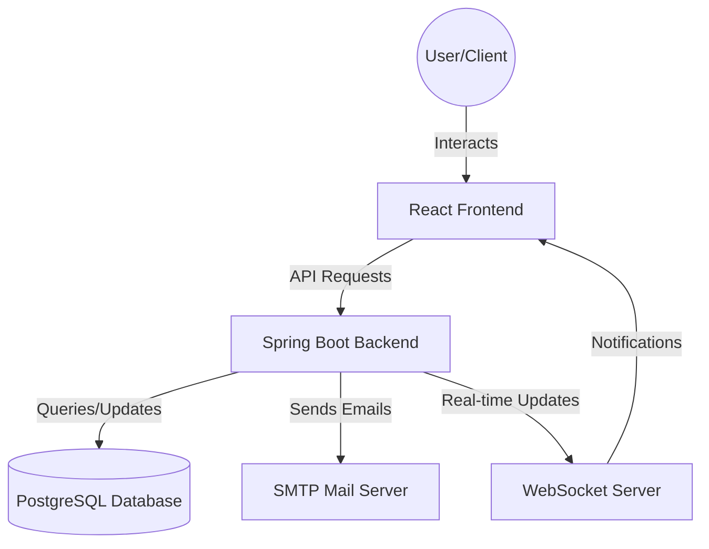

# Data Flow Diagram: System Overview

```mermaid
graph TD
    User((User/Client)) -->|Interacts| Frontend[React Frontend]
    Frontend -->|API Requests| Backend[Spring Boot Backend]
    Backend -->|Queries/Updates| DB[(PostgreSQL Database)]
    Backend -->|Sends Emails| MailServer[SMTP Mail Server]
    Backend -->|Real-time Updates| WebSocket[WebSocket Server]
    WebSocket -->|Notifications| Frontend
```
