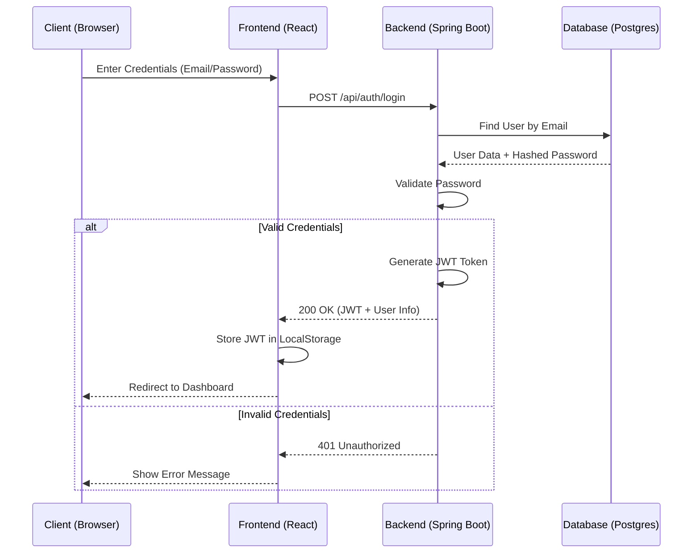

# Sequence Diagram: Authentication Flow

```mermaid
sequenceDiagram
    participant C as Client (Browser)
    participant F as Frontend (React)
    participant B as Backend (Spring Boot)
    participant D as Database (Postgres)

    C->>F: Enter Credentials (Email/Password)
    F->>B: POST /api/auth/login
    B->>D: Find User by Email
    D-->>B: User Data + Hashed Password
    B->>B: Validate Password
    alt Valid Credentials
        B->>B: Generate JWT Token
        B-->>F: 200 OK (JWT + User Info)
        F->>F: Store JWT in LocalStorage
        F-->>C: Redirect to Dashboard
    else Invalid Credentials
        B-->>F: 401 Unauthorized
        F-->>C: Show Error Message
    end
```
